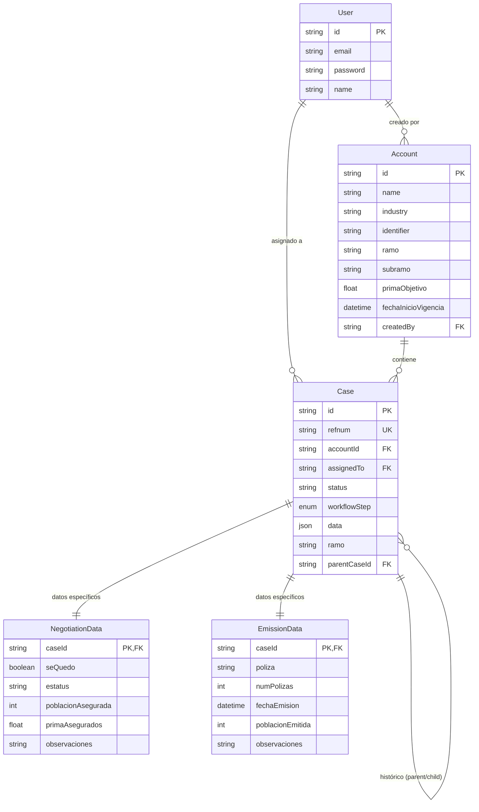

# 🗄 Estructura de Base de Datos (Schema)

Este documento detalla la estructura lógica de la base de datos utilizada por el Pipeline Workflow. El motor de base de datos es **PostgreSQL** y la gestión se realiza a través de **Prisma ORM**.

## 📐 Diagrama de Entidad-Relación

## 📋 Diccionario de Tablas

### 1. `Account` (Cuentas)
Almacena los datos maestros de la empresa/cliente.

| Campo | Tipo | Notas |
|---|---|---|
| `id` | UUID | Clave primaria. |
| `name` | String | Razón Social / Nombre Comercial. |
| `identifier` | String | RFC / Identificador fiscal único. |
| `industry` | String | Giro de negocio (Retail, Manufactura, etc). |
| `ramo` | String | Categoría principal (Autos, Daños, Vida, Salud). |
| `subramo` | String | Subcategoría específica. |
| `primaObjetivo` | Float | Valor objetivo de la cuenta. |
| `fechaInicioVigencia`| DateTime | Fecha de inicio de la póliza. |

### 2. `Case` (Casos)
La entidad central del workflow.

| Campo | Tipo | Notas |
|---|---|---|
| `id` | UUID | Clave primaria. |
| `refnum` | String | Folio único (ej: DEMO-001-01). |
| `workflowStep`| Enum | Etapa actual: `ALTA`, `NEGOCIACION`, `EMISION`, `TERMINADO`. |
| `status` | String | Estado administrativo: `ACTIVO`, `CANCELADO`, `RECHAZADO`, `TERMINADO`. |
| `data` | **JSON** | Almacena todos los campos dinámicos del formulario de Alta (ver abajo). |

### 🛠 Estructura del campo `Case.data` (JSON)
Para permitir flexibilidad sin migraciones de esquema, los siguientes campos se guardan en el objeto JSON de la columna `data`:

- **Generales**: `tipoExperiencia`, `etapa` (interno), `cuidadoIntegral`, `cuentaConPlanmed`, `plan`.
- **Agente**: `claveAgente`, `nombreAgente`, `promotor`, `territorio`, `oficina`, `canal`, `centroCostos`.
- **Suscripción**: `nuevoConducto`, `nearshoring`, `primaCotizada`, `poblacion`, `incisos`, `ubicaciones`, `instanciaFolio`, `responsableSuscripcion`, `fechaSolicitud`, `fechaEntrega`.

### 3. `NegotiationData`
Datos específicos capturados durante la etapa de Negociación. Relación 1:1 con `Case`.

### 4. `EmissionData`
Datos específicos capturados durante la etapa de Emisión. Relación 1:1 con `Case`.
